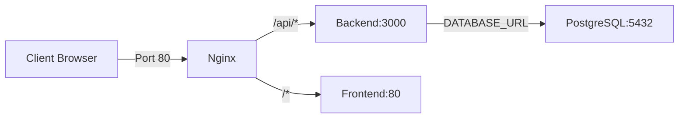

## Overview

DRAIT Mini-MES uses Docker Compose to orchestrate a multi-container application with four main services:

- **drait-db**: PostgreSQL 16 database
- **drait-backend**: NestJS API server
- **drait-frontend**: React/Vite application
- **drait-nginx**: Reverse proxy and static file server

## Architecture



## Services Configuration

### Database (drait-db)

PostgreSQL 16 Alpine container with persistent storage:

```yaml docker-compose.yml
services:
  drait-db:
    image: postgres:16-alpine
    container_name: drait-db
    restart: unless-stopped
    environment:
      POSTGRES_DB: ${POSTGRES_DB}
      POSTGRES_USER: ${POSTGRES_USER}
      POSTGRES_PASSWORD: ${POSTGRES_PASSWORD}
      TZ: ${TZ}
    volumes:
      - postgres_data:/var/lib/postgresql/data
    ports:
      - "${POSTGRES_PORT}:5432"
    healthcheck:
      test: ["CMD-SHELL", "pg_isready -U ${POSTGRES_USER} -d ${POSTGRES_DB}"]
      interval: 10s
      timeout: 5s
      retries: 5
```

**Health Check**: Runs `pg_isready` every 10 seconds to verify database availability.

### Backend (drait-backend)

NestJS API built from source with Prisma ORM:

```yaml docker-compose.yml
services:
  drait-backend:
    build:
      context: ./apps/backend
      dockerfile: Dockerfile
    container_name: drait-backend
    restart: unless-stopped
    depends_on:
      drait-db:
        condition: service_healthy
    environment:
      NODE_ENV: ${NODE_ENV}
      TZ: ${TZ}
      BACKEND_PORT: ${BACKEND_PORT}
      DATABASE_URL: ${DATABASE_URL}
      JWT_SECRET: ${JWT_SECRET}
      JWT_EXPIRES_IN: ${JWT_EXPIRES_IN}
      CORS_ORIGIN: ${CORS_ORIGIN}
    healthcheck:
      test: ["CMD-SHELL", "node -e \"require('http').get('http://localhost:3000/api/auth/status', r => process.exit(r.statusCode === 200 ? 0 : 1)).on('error', () => process.exit(1))\""]
      interval: 15s
      timeout: 5s
      retries: 5
      start_period: 30s
```

**Key Features**:
- Waits for database health check before starting
- Multi-stage build (deps → builder → runner)
- Health check via `/api/auth/status` endpoint
- 30s start period to allow for database migrations

### Frontend (drait-frontend)

React/Vite application built and served via Nginx:

```yaml docker-compose.yml
services:
  drait-frontend:
    build:
      context: ./apps/frontend
      dockerfile: Dockerfile
      args:
        VITE_API_BASE_URL: ${VITE_API_BASE_URL}
    container_name: drait-frontend
    restart: unless-stopped
```

**Build Process**:
- Compiles Vite app with environment variables baked in
- Bundles static assets into Nginx container
- No exposed ports (proxied through main Nginx)

### Nginx (drait-nginx)

Reverse proxy routing traffic between frontend and backend:

```yaml docker-compose.yml
services:
  drait-nginx:
    image: nginx:1.27-alpine
    container_name: drait-nginx
    restart: unless-stopped
    depends_on:
      drait-backend:
        condition: service_started
      drait-frontend:
        condition: service_started
    ports:
      - "${HTTP_PORT}:80"
    volumes:
      - ./infra/nginx/default.conf:/etc/nginx/conf.d/default.conf:ro
```

**Routing Rules** (see `infra/nginx/default.conf:7`):
- `/api/*` → `drait-backend:3000`
- `/*` → `drait-frontend:80`
- Client max body size: 10MB

## Volume Mounts

### Persistent Storage

```yaml docker-compose.yml
volumes:
  postgres_data:
```

The `postgres_data` named volume stores all PostgreSQL data persistently.

### Configuration Files

- `./infra/nginx/default.conf:/etc/nginx/conf.d/default.conf:ro` - Nginx routing config (read-only)

## Building and Starting Services

<Steps>
  <Step title="Prepare environment file">
    Copy the example environment file and configure your settings:
    
    ```bash
    cp .env.example .env
    ```
    
    Edit `.env` with your production values. See [Environment Variables](/deployment/environment-variables) for details.
  </Step>
  
  <Step title="Build images">
    Build all Docker images from source:
    
    ```bash
    docker compose build
    ```
    
    This will:
    - Build the backend NestJS application
    - Build the frontend React/Vite application
    - Pull PostgreSQL and Nginx images
  </Step>
  
  <Step title="Start services">
    Start all containers in detached mode:
    
    ```bash
    docker compose up -d
    ```
    
    The startup sequence:
    1. `drait-db` starts and runs health checks
    2. `drait-backend` waits for DB health, then starts
    3. `drait-frontend` starts independently
    4. `drait-nginx` starts after backend and frontend
  </Step>
  
  <Step title="Run database migrations">
    Initialize the database schema and seed demo data:
    
    ```bash
    docker compose exec drait-backend npm run prisma:migrate
    docker compose exec drait-backend npm run prisma:seed
    ```
    
    See [Database Setup](/deployment/database-setup) for details.
  </Step>
  
  <Step title="Verify deployment">
    Check all services are running:
    
    ```bash
    docker compose ps
    ```
    
    Access the application:
    - Frontend: `http://localhost` (or your configured `HTTP_PORT`)
    - API: `http://localhost/api`
    - Database: `localhost:5432`
  </Step>
</Steps>

## Viewing Logs

### All Services

```bash
# View logs from all services
docker compose logs -f

# View logs with timestamps
docker compose logs -f -t

# View last 100 lines
docker compose logs --tail=100
```

### Individual Services

<CodeGroup>
```bash Backend
# Follow backend logs
docker compose logs -f drait-backend

# Search for errors
docker compose logs drait-backend | grep -i error
```

```bash Frontend
# Follow frontend build logs
docker compose logs -f drait-frontend
```

```bash Database
# View database logs
docker compose logs -f drait-db

# Check connection attempts
docker compose logs drait-db | grep "connection"
```

```bash Nginx
# View access logs
docker compose logs -f drait-nginx

# Filter by status code
docker compose logs drait-nginx | grep "500"
```
</CodeGroup>

## Container Management

### Stop Services

```bash
# Stop all services
docker compose stop

# Stop specific service
docker compose stop drait-backend
```

### Restart Services

```bash
# Restart all services
docker compose restart

# Restart after code changes (rebuild)
docker compose up -d --build drait-backend
```

### Remove Containers

```bash
# Stop and remove containers
docker compose down

# Remove containers and volumes (DANGER: deletes data)
docker compose down -v
```

## Health Check Endpoints

Monitor service health:

<CodeGroup>
```bash Backend Health
curl http://localhost/api/auth/status
# Expected: {"status":"ok"} with 200 status code
```

```bash Database Health
docker compose exec drait-db pg_isready -U drait -d drait_mes
# Expected: drait_mes:5432 - accepting connections
```

```bash Container Health
docker compose ps
# Check "Status" column for "healthy" state
```
</CodeGroup>

<Note>
  Backend health checks have a 30-second `start_period` to allow for application initialization and potential database migrations.
</Note>

## Port Mappings

| Service | Internal Port | External Port | Purpose |
|---------|--------------|---------------|----------|
| drait-nginx | 80 | `${HTTP_PORT}` (default: 80) | HTTP traffic entry point |
| drait-backend | 3000 | - | API server (internal only) |
| drait-frontend | 80 | - | Static files (internal only) |
| drait-db | 5432 | `${POSTGRES_PORT}` (default: 5432) | PostgreSQL connections |

<Warning>
  Only the Nginx and database ports are exposed to the host. The backend and frontend are accessible only through the internal Docker network, providing better security.
</Warning>

## Rebuild After Changes

<Steps>
  <Step title="Backend code changes">
    ```bash
    docker compose up -d --build drait-backend
    ```
  </Step>
  
  <Step title="Frontend code changes">
    ```bash
    docker compose up -d --build drait-frontend
    ```
  </Step>
  
  <Step title="Nginx config changes">
    ```bash
    docker compose restart drait-nginx
    ```
    
    No rebuild needed since config is mounted as a volume.
  </Step>
  
  <Step title="Environment variable changes">
    ```bash
    docker compose up -d --force-recreate
    ```
    
    Recreates containers with new environment values.
  </Step>
</Steps>

## Next Steps

- Configure [Environment Variables](/deployment/environment-variables)
- Set up [Database](/deployment/database-setup) with migrations and seed data
- Configure [Monitoring](/deployment/monitoring) for production deployments
- Review [Troubleshooting](/deployment/troubleshooting) for common issues