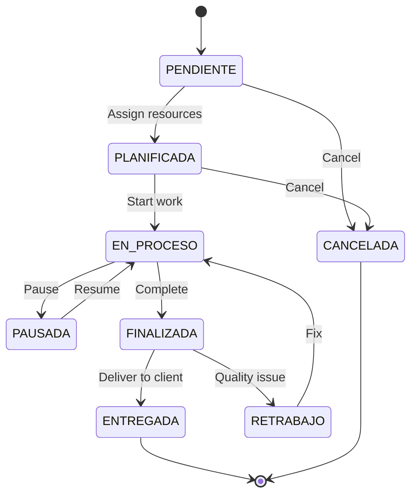

# Key Features

DRAIT Mini-MES is a complete Manufacturing Execution System designed specifically for metalworking and welding shops. Built with modern technology, it provides end-to-end traceability and operational control.

## Core Capabilities

<CardGroup cols={3}>
  <Card title="Client Management" icon="users" href="#client-management">
    Complete CRM for customer relationships and contact tracking
  </Card>
  <Card title="Quotation System" icon="file-invoice" href="#quotation-system">
    Multi-item quotations with approval workflow and OT conversion
  </Card>
  <Card title="Work Orders" icon="clipboard-check" href="#work-order-management">
    Full lifecycle management from planning to delivery
  </Card>
  <Card title="Resource Management" icon="cogs" href="#resource-management">
    Track machines and personnel assignments in real-time
  </Card>
  <Card title="Material Control" icon="boxes" href="#inventory-control">
    Inventory tracking with consumption history per work order
  </Card>
  <Card title="Role-Based Access" icon="shield-alt" href="#role-based-access-control">
    Four-tier permission system tailored to shop hierarchy
  </Card>
  <Card title="Dashboard & KPIs" icon="chart-line" href="#dashboard-kpis">
    Real-time metrics and productivity analytics
  </Card>
  <Card title="Operation Logs" icon="history" href="#traceability-logs">
    Complete traceability of all shop floor events
  </Card>
  <Card title="Audit Trail" icon="clipboard-list" href="#audit-system">
    System-wide audit logging for compliance
  </Card>
</CardGroup>

---

## Client Management

Manage customer relationships with comprehensive contact and activity tracking.

### Features
- Full CRUD operations for client records
- Contact information (name, phone, email, address)
- Custom notes and reference fields
- Soft delete with `isActive` flag for data retention
- Direct links to quotations and work orders

### Implementation Details

The client module is implemented in the backend at `apps/backend/src/modules/clients/` with the following key endpoints:

```typescript
// From clients.controller.ts
GET    /api/clients          // List all clients (paginated)
GET    /api/clients/:id      // Get client details
POST   /api/clients          // Create new client
PATCH  /api/clients/:id      // Update client
DELETE /api/clients/:id      // Soft delete (sets isActive=false)
```

<Info>
All client operations are scoped to the user's company using the `companyId` from the JWT token, ensuring complete data isolation in multi-tenant scenarios.
</Info>

### Data Model

From `prisma/schema.prisma:146-164`:

```prisma
model Client {
  id         String      @id @default(cuid())
  companyId  String
  name       String
  contact    String?
  phone      String?
  email      String?
  address    String?
  notes      String?
  isActive   Boolean     @default(true)
  createdAt  DateTime    @default(now())
  updatedAt  DateTime    @updatedAt
  company    Company     @relation(...)
  quotations Quotation[]
  workOrders WorkOrder[]
}
```

---

## Quotation System

Create professional quotations with line items and track approval status.

### Workflow States

<Steps>
  <Step title="Draft Creation">
    Supervisor creates quotation with multiple line items, estimated costs, and time
  </Step>
  <Step title="Send to Client">
    Change status to `ENVIADO` (Sent) with optional validity date
  </Step>
  <Step title="Client Decision">
    Mark as `APROBADO` (Approved) or `RECHAZADO` (Rejected)
  </Step>
  <Step title="Convert to Work Order">
    Approved quotations can be converted to work orders with one click
  </Step>
</Steps>

### Status Enumeration

```typescript
enum QuotationStatus {
  BORRADOR    // Draft - in progress
  ENVIADO     // Sent to client
  APROBADO    // Approved by client
  RECHAZADO   // Rejected by client
}
```

### Multi-Item Support

Each quotation supports multiple line items (`QuotationItem`) with:
- Item description
- Quantity and unit of measure
- Estimated unit cost
- Estimated hours per item
- Visual ordering via `position` field

### Key Endpoints

```typescript
POST /api/quotations                           // Create quotation
PATCH /api/quotations/:id                      // Update quotation
PATCH /api/quotations/:id/status               // Change status
POST /api/work-orders/from-quotation/:quotationId  // Convert to OT
```

<Tip>
When converting a quotation to a work order, the system automatically copies all quotation details including items, estimated time, and costs. The original quotation remains linked via the `quotationId` field.
</Tip>

---

## Work Order Management

The heart of the MES system - complete work order lifecycle management.

### Work Order Lifecycle



### Status Definitions

| Status | Description | Typical Actions |
|--------|-------------|----------------|
| `PENDIENTE` | Created, awaiting planning | Assign resources |
| `PLANIFICADA` | Resources assigned, ready to start | Start work |
| `EN_PROCESO` | Active work in progress | Log events, consume materials |
| `PAUSADA` | Temporarily stopped | Resume with reason |
| `FINALIZADA` | Work completed | Review, prepare delivery |
| `ENTREGADA` | Delivered to client with signed remit | Archive |
| `RETRABAJO` | Rework required due to quality issue | Fix and restart |
| `CANCELADA` | Cancelled before completion | Archive |

### Core Features

#### Resource Assignment
Assign operators and machines to work orders:

```typescript
// From apps/backend/src/modules/work-orders/work-orders.controller.ts
POST /api/work-orders/:id/assignments
{
  "resourceId": "clxx...",
  "userId": "clxx..."  // Optional: link specific operator
}
```

#### Operation Events
Log all significant events with full traceability:

```typescript
POST /api/work-orders/:id/events
{
  "eventType": "INICIO" | "PAUSA" | "REANUDACION" | "FINALIZACION" | "NOTA",
  "eventAt": "2026-03-13T10:30:00Z",
  "pauseReason": "Esperando material",  // For PAUSA events
  "note": "Custom observation"
}
```

Event types from `schema.prisma:55-65`:
- `OT_CREADA` - Work order created
- `ASIGNADO` - Resource/operator assigned
- `INICIO` - Work started
- `PAUSA` - Work paused
- `REANUDACION` - Work resumed
- `FINALIZACION` - Work finished
- `CAMBIO_ESTADO` - Status changed
- `MATERIAL_CONSUMIDO` - Material consumed
- `NOTA` - Free-form note

#### Material Consumption
Track material usage per work order:

```typescript
POST /api/work-orders/:id/consumptions
{
  "materialId": "clxx...",
  "quantity": 2.5,
  "note": "Chapa cortada para lateral"
}
```

<Warning>
Material consumption creates a snapshot of the unit cost at consumption time (`unitCostSnapshot`). This preserves accurate costing even if material prices change later.
</Warning>

#### Delivery Management
- `deliveryChecklist` - Pre-delivery verification items
- `deliveryNote` - Shipping/remit notes
- `attachmentUrl` - Signed delivery receipt upload
- `isSigned` - Boolean flag for signature confirmation
- `deliveredAt` - Timestamp of delivery

### Data Model Highlights

From `schema.prisma:212-252`:

```prisma
model WorkOrder {
  id                   String               @id @default(cuid())
  companyId            String
  clientId             String
  quotationId          String?              // Link to original quotation
  code                 String               // e.g., OT-2026-001
  title                String
  description          String
  status               WorkOrderStatus
  priority             Int                  @default(3)  // 1=high, 5=low
  plannedDate          DateTime?
  commitmentDate       DateTime?            // Client commitment
  startedAt            DateTime?
  finishedAt           DateTime?
  deliveredAt          DateTime?
  estimatedTimeMin     Int                  // Estimated duration
  estimatedCost        Decimal
  // ... delivery fields
  assignments          WorkOrderAssignment[]
  operationLogs        OperationLog[]
  materialConsumptions MaterialConsumption[]
}
```

---

## Resource Management

Manage both human resources (operators) and machines.

### Resource Types

<Tabs>
  <Tab title="Human Resources">
    Operators and staff members who work on orders.
    
    - Linked to user accounts via `WorkOrderAssignment.userId`
    - Track availability status
    - Assign to multiple work orders sequentially
    - Sector/department grouping
  </Tab>
  <Tab title="Machines">
    Equipment and machinery used in production.
    
    - Welding machines, CNC, lathes, etc.
    - Status tracking (available, busy, maintenance)
    - Maintenance scheduling support
    - Assignment history for utilization reports
  </Tab>
</Tabs>

### Status Management

```typescript
enum ResourceStatus {
  DISPONIBLE     // Available for assignment
  OCUPADO        // Currently assigned to work order
  MANTENIMIENTO  // Under maintenance
  FUERA_DE_LINEA // Out of service
}
```

### Data Model

From `schema.prisma:255-272`:

```prisma
model Resource {
  id            String                @id @default(cuid())
  companyId     String
  type          ResourceType          // HUMANO | MAQUINA
  name          String
  sector        String?               // e.g., "Soldadura", "Corte"
  status        ResourceStatus
  notes         String?
  isActive      Boolean               @default(true)
  assignments   WorkOrderAssignment[]
  operationLogs OperationLog[]
}
```

<Info>
Resource status should be updated automatically when assignments are created/completed, though the current implementation allows manual status management for flexibility.
</Info>

---

## Inventory Control

Track materials, stock levels, and consumption by work order.

### Material Management Features

- **Stock tracking** with decimal precision (e.g., 2.5 kg, 10.25 m)
- **Category organization** (e.g., "Chapas", "Electrodos", "Pintura")
- **Unit cost** tracking per material
- **Movement history** - all stock adjustments logged
- **Consumption traceability** - link usage to specific work orders

### Stock Movement Types

```typescript
enum MaterialMovementType {
  ENTRADA   // Stock entry (purchase, reception)
  AJUSTE    // Manual adjustment (correction, inventory)
  CONSUMO   // Stock exit (consumed in production)
}
```

### API Endpoints

```typescript
GET  /api/materials              // List all materials with current stock
POST /api/materials              // Create new material
POST /api/materials/:id/adjust-stock  // Adjust stock level
```

### Stock Adjustment Example

```typescript
// From materials.controller.ts
POST /api/materials/:id/adjust-stock
{
  "type": "ENTRADA",      // ENTRADA | AJUSTE | CONSUMO
  "quantity": 100,         // Positive for entry, negative for exit
  "unitCost": 15.50,       // Cost per unit at time of movement
  "note": "Compra proveedor XYZ"
}
```

### Consumption Tracking

When materials are consumed in production:

1. **Recorded against work order** via `MaterialConsumption` table
2. **Cost snapshot** preserved for accurate job costing
3. **Stock automatically reduced** (when integrated with movements)
4. **Audit trail** maintained with operator and timestamp

<Tip>
The system captures `unitCostSnapshot` at consumption time, allowing you to calculate true job costs even if material prices fluctuate during long-running projects.
</Tip>

---

## Role-Based Access Control

Four-tier permission system aligned with shop floor hierarchy.

### Role Definitions

<CardGroup cols={2}>
  <Card title="OPERARIO" icon="hard-hat">
    **Shop Floor Operator**
    
    - Access only to "My Shift" view
    - See assigned work orders
    - Log events and material consumption
    - Cannot create or modify orders
  </Card>
  
  <Card title="SUPERVISOR" icon="user-tie">
    **Production Supervisor**
    
    - Full dashboard access
    - Manage clients and quotations
    - Create and assign work orders
    - View all reports
    - Cannot manage users or audit logs
  </Card>
  
  <Card title="DUEÑO" icon="crown">
    **Shop Owner**
    
    - Complete system access
    - User management
    - Audit log viewing
    - System configuration
    - All supervisor capabilities
  </Card>
  
  <Card title="ADMIN" icon="user-shield">
    **System Administrator**
    
    - Identical to DUEÑO permissions
    - Technical administration
    - Multi-company management (future)
  </Card>
</CardGroup>

### Implementation

Roles are enforced at multiple layers:

#### 1. Backend Guards

From `apps/backend/src/common/auth/roles.guard.ts` and `roles.decorator.ts`:

```typescript
// Protecting endpoints with role requirements
@Roles('DUENO', 'ADMIN')  // Only owner/admin can access
@UseGuards(JwtAuthGuard, RolesGuard)
@Get('users')
listUsers() { ... }
```

#### 2. JWT Payload

From `apps/backend/src/modules/auth/auth.service.ts:47-53`:

```typescript
const payload: JwtUser = {
  sub: user.id,
  companyId: user.companyId,
  role: user.role,           // Role embedded in token
  email: user.email,
  fullName: user.fullName
};
```

#### 3. Frontend Route Protection

From `apps/frontend/src/features/auth/ProtectedRoute.tsx`, routes are guarded based on user role, redirecting unauthorized users.

### Permission Matrix

| Feature | OPERARIO | SUPERVISOR | DUEÑO/ADMIN |
|---------|----------|------------|-------------|
| View assigned work orders | ✅ | ✅ | ✅ |
| View all work orders | ❌ | ✅ | ✅ |
| Create/edit work orders | ❌ | ✅ | ✅ |
| Manage clients | ❌ | ✅ | ✅ |
| Manage quotations | ❌ | ✅ | ✅ |
| View dashboard/reports | ❌ | ✅ | ✅ |
| Manage users | ❌ | ❌ | ✅ |
| View audit logs | ❌ | ❌ | ✅ |
| System configuration | ❌ | ❌ | ✅ |

---

## Dashboard & KPIs

Real-time operational metrics and productivity analytics.

### Dashboard Endpoint

From `apps/backend/src/modules/reports/reports.controller.ts:17-19`:

```typescript
@Get('dashboard')
dashboard(@CurrentUser() user: JwtUser) {
  return this.service.dashboard(user);
}
```

### Key Performance Indicators

The dashboard service provides:

- **Active work orders** count and details
- **Orders by status** distribution
- **Resource utilization** rates
- **On-time delivery** percentage
- **Material consumption** trends
- **Revenue by client** rankings
- **Productivity metrics** (time vs. estimated)

### Productivity Reports

Advanced filtering from `reports.controller.ts:23-32`:

```typescript
@Get('productivity')
productivity(
  @Query('from') from?: string,        // Date range start
  @Query('to') to?: string,            // Date range end
  @Query('clientId') clientId?: string,  // Filter by client
  @Query('operatorId') operatorId?: string,  // Filter by operator
  @Query('status') status?: string     // Filter by OT status
)
```

### Frontend Visualization

The frontend uses **Recharts** (from `package.json:22`) for data visualization:

- Line charts for productivity trends
- Bar charts for resource utilization
- Pie charts for status distribution
- Area charts for material consumption over time

<Info>
All dashboard data is automatically scoped to the user's company via the `companyId` in their JWT token, ensuring data isolation.
</Info>

---

## Traceability Logs

Complete operational event logging for full shop floor traceability.

### Operation Log Events

Every significant event is recorded in the `OperationLog` table with:

- **Event type** - from `OperationEventType` enum
- **Timestamp** - precise event time
- **Work order** reference
- **Resource** reference (machine/operator)
- **User** who triggered the event
- **Additional context** - pause reasons, notes, etc.

### Event Types

From `schema.prisma:55-65`:

```prisma
enum OperationEventType {
  OT_CREADA           // Work order created
  ASIGNADO            // Resource assigned
  INICIO              // Work started
  PAUSA               // Work paused
  REANUDACION         // Work resumed
  FINALIZACION        // Work completed
  CAMBIO_ESTADO       // Status changed
  MATERIAL_CONSUMIDO  // Material consumed
  NOTA                // Free-form note
}
```

### API Access

```typescript
GET /api/operation-logs                    // All logs (paginated)
GET /api/operation-logs/work-order/:id     // Logs for specific OT
```

### Use Cases

<Accordion title="Quality Investigation">
When a quality issue arises, review the operation log to see:
- Who worked on the order
- When work started/paused/resumed
- What materials were used
- Any notes logged during production
</Accordion>

<Accordion title="Time Analysis">
Calculate actual vs. estimated time:
- `INICIO` to `FINALIZACION` delta
- Exclude `PAUSA` periods
- Compare against `estimatedTimeMin`
</Accordion>

<Accordion title="Resource Utilization">
Track machine/operator productivity:
- Count `ASIGNADO` events per resource
- Calculate time between events
- Identify bottlenecks
</Accordion>

---

## Audit System

System-wide audit trail for compliance and security.

### Audit Log Scope

The `AuditLog` table (from `schema.prisma:367-384`) tracks:

- **Entity changes** across all major tables
- **User actions** with full attribution
- **Before/after snapshots** (JSON diff)
- **Additional metadata** (IP, user agent, etc.)
- **Timestamp** with millisecond precision

### Audited Entities

```typescript
enum AuditEntityType {
  COMPANY
  USER
  CLIENT
  QUOTATION
  WORK_ORDER
  RESOURCE
  MATERIAL
  AUTH          // Login/logout events
}
```

### Audited Actions

```typescript
enum AuditActionType {
  CREATE
  UPDATE
  DELETE
  STATUS_CHANGE      // Work order or quotation status
  ASSIGN             // Resource assignment
  DELIVERY_CLOSE     // Work order delivery
  PASSWORD_CHANGE
  ROLE_CHANGE
  SETTINGS_CHANGE
  LOGIN
}
```

### Automatic Audit Logging

From `apps/backend/src/modules/auth/auth.service.ts:60-69`, login events are automatically audited:

```typescript
await this.auditService.log({
  companyId: user.companyId,
  userId: user.id,
  entityType: 'AUTH',
  entityId: user.id,
  action: 'LOGIN',
  metadata: {
    email: user.email
  }
});
```

### Audit Log Structure

```prisma
model AuditLog {
  id         String          @id @default(cuid())
  companyId  String
  userId     String?         // Who performed the action
  entityType AuditEntityType // What was changed
  entityId   String          // Which record
  action     AuditActionType // What happened
  before     Json?           // State before change
  after      Json?           // State after change
  metadata   Json?           // Additional context
  createdAt  DateTime        @default(now())
}
```

<Warning>
**Access Control**: Only users with `DUENO` or `ADMIN` roles can view audit logs. This is typically enforced in the frontend routing and backend controllers.
</Warning>

### Compliance Benefits

- **ISO 9001** traceability requirements
- **Change tracking** for quality investigations
- **Security monitoring** - detect unauthorized access attempts
- **User accountability** - full attribution of all actions
- **Data recovery** - restore previous states from `before` snapshots

---

## Next Steps

<CardGroup cols={2}>
  <Card title="System Architecture" icon="sitemap" href="/system-architecture">
    Learn about the technical architecture and deployment
  </Card>
  <Card title="Getting Started" icon="rocket" href="/getting-started">
    Set up your first installation
  </Card>
  <Card title="User Guides" icon="book" href="/guides/owner-guide">
    Role-specific user documentation
  </Card>
  <Card title="API Reference" icon="code" href="/api/overview">
    Complete API endpoint documentation
  </Card>
</CardGroup>
