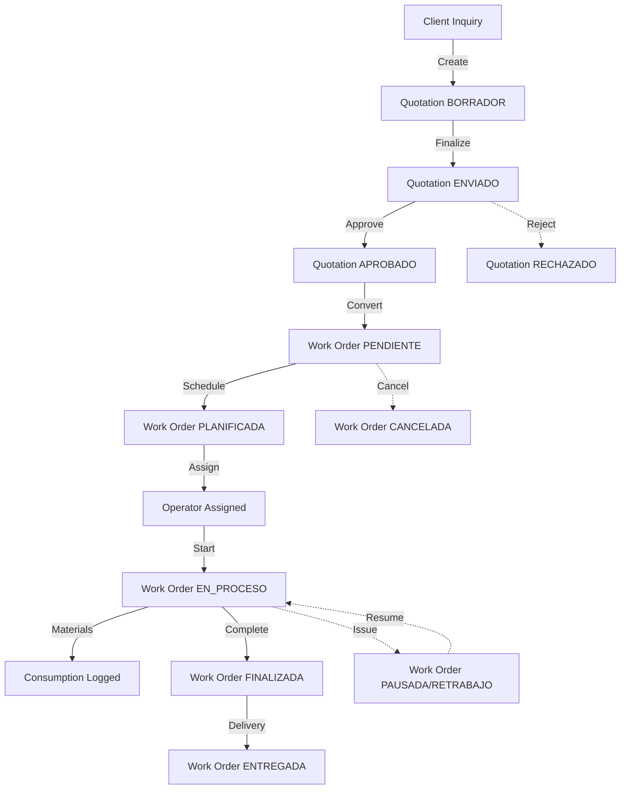

## Overview

The DRAIT Mini-MES production workflow orchestrates your entire manufacturing process from initial customer quote through final delivery. It connects commercial, planning, execution, and delivery phases with complete event traceability and real-time status tracking.

<CardGroup cols={2}>
  <Card title="Quotation to Production" icon="arrow-right">
    Seamless conversion from approved quotes to executable work orders
  </Card>
  <Card title="Lifecycle Management" icon="rotate">
    8-state workflow tracking every stage of production
  </Card>
  <Card title="Event Traceability" icon="list-timeline">
    Timestamped events for every action, pause, and state change
  </Card>
  <Card title="Multi-Role Collaboration" icon="users-gear">
    Coordinated workflow across admin, supervisor, and operator roles
  </Card>
</CardGroup>

## End-to-End Production Flow

The complete manufacturing cycle in DRAIT Mini-MES:



## Phase 1: Commercial (Quotations)

### Quote Creation

**Who:** Admin, Supervisor

**Actions:**
1. Navigate to Quotations module
2. Click **+ Nueva Cotización**
3. System generates sequential code (Q-2026-045)
4. Select client from database
5. Enter project title and description
6. Add detailed line items:
   - Material descriptions
   - Quantities and units
   - Unit costs and hours
7. Set total estimated time and cost
8. Optionally add validity date
9. Status: **BORRADOR**

**Key Data Captured:**
- Client relationship
- Cost breakdown by item
- Time estimates per component
- Total project valuation
- Expiration timeline

### Quote Management

<Steps>
  <Step title="Draft Stage (BORRADOR)">
    - Internal cost calculations
    - Review and refinement
    - Attach technical specifications
    - Upload drawings or CAD files
    - Can modify freely
  </Step>
  
  <Step title="Send to Client (ENVIADO)">
    - Update status to ENVIADO
    - Quote formally presented to client
    - Validity period active
    - Still editable if negotiations occur
  </Step>
  
  <Step title="Client Decision">
    **If Approved:**
    - Set status to APROBADO
    - Proceed to work order conversion
    - Quote locked from major changes
    
    **If Rejected:**
    - Set status to RECHAZADO
    - Keep for pipeline analysis
    - Can duplicate for revised quote
  </Step>
</Steps>

### Conversion to Work Order

**Prerequisites:**
- Quotation status = APROBADO
- Valid client assigned
- All cost data complete

**Process:**

1. Open quotation management modal
2. Navigate to "🚀 Convertir a Orden de Trabajo"
3. System suggests OT code (e.g., OT-2026-045)
4. Optionally set commitment date for delivery
5. Click **⚡ Confirmar y Enviar a Producción**

**What Gets Created:**

```typescript
// New Work Order inherits:
{
  code: "OT-2026-045",            // User-specified
  clientId: quotation.clientId,    // Same client
  title: quotation.title,
  description: quotation.description,
  estimatedTimeMin: quotation.estimatedTimeMin,
  estimatedCost: quotation.estimatedCost,
  quotationId: quotation.id,       // Link back to quote
  commitmentDate: userInput,       // Optional
  priority: 3,                     // From company settings
  status: "PENDIENTE"              // Initial status
}
```

**Post-Conversion:**
- Original quotation preserved
- Quote cannot be deleted (has linked WO)
- Work order appears in planning queue
- Ready for resource assignment

## Phase 2: Planning

### Work Order Scheduling

**Who:** Admin, Supervisor

**Objective:** Move from PENDIENTE to PLANIFICADA

<Steps>
  <Step title="Review New Orders">
    - Check work orders in PENDIENTE status
    - Review commitment dates
    - Assess priority (1-5 scale)
    - Verify material availability
  </Step>
  
  <Step title="Resource Assignment">
    1. Open work order management
    2. In "Asignar Puesto" section:
       - Select operator from dropdown
       - System links operator's user account
       - Links to matching HUMANO resource
    3. Click **Asignar**
    4. Assignment creates:
       - Resource-to-WO link
       - User-to-WO link
       - WO visibility in operator terminal
  </Step>
  
  <Step title="Material Preparation">
    - Verify material stock levels
    - Adjust inventory if needed
    - Prepare kitting or staging
    - Document in work order notes
  </Step>
  
  <Step title="Status Update">
    - Change status to PLANIFICADA (if using status workflow)
    - Or leave as PENDIENTE until operator starts
    - Set planned date if scheduling in advance
  </Step>
</Steps>

### Capacity Planning

**Supervisor Dashboard View:**

The Supervisor page (`SupervisorPage.tsx`) provides real-time capacity overview:

- **En proceso**: Active production count
- **Pausadas**: Temporarily stopped orders
- **Atrasadas**: Orders past commitment date
- **Operarios activos**: Number of assigned operators

**Data Displayed:**
```typescript
interface SupervisorMetrics {
  activeOrders: WorkOrder[];        // EN_PROCESO + PAUSADA
  pendingOrders: WorkOrder[];       // PENDIENTE + PLANIFICADA
  delayedOrders: WorkOrder[];       // Past commitmentDate
  activeOperators: {
    id: string;
    fullName: string;
    orders: string[];               // WO codes assigned
  }[];
}
```

**Auto-Refresh:** Dashboard updates every 30 seconds for live monitoring.

## Phase 3: Execution (Operator Terminal)

### Operator Workflow

**Who:** OPERARIO role users

**View:** Restricted to assigned work orders only

<Tabs>
  <Tab title="Start Production">
    **Trigger:** Operator ready to begin work
    
    1. Login to operator terminal
    2. View "Cola de Trabajo" (work queue)
    3. Find assigned order with PLANIFICADA or PENDIENTE status
    4. Click **▶ Iniciar** button
    
    **System Actions:**
    - Creates INICIO event with timestamp
    - Changes status to EN_PROCESO
    - Begins time tracking
    - Records operator user ID
    - Logs event in audit trail
    
    **Event Record:**
    ```json
    {
      "eventType": "INICIO",
      "eventAt": "2026-03-13T08:15:00Z",
      "user": {
        "id": "user-uuid",
        "fullName": "Rodriguez, Carlos"
      },
      "note": "Inicio operativo"
    }
    ```
  </Tab>
  
  <Tab title="Material Consumption">
    **During production:** Log materials as used
    
    1. Click **📦 Insumos y Notas** to expand
    2. In "Registrar Consumo" form:
       - Select material (dropdown shows stock)
       - Enter quantity consumed
       - Add optional note (batch, observations)
    3. Click **+ Registrar Consumo Fisico**
    
    **System Actions:**
    - Validates stock availability
    - Reduces material inventory
    - Creates consumption record
    - Captures unit cost snapshot
    - Links to work order
    - Updates work order real cost
    
    **Consumption Record:**
    ```typescript
    {
      workOrderId: "wo-uuid",
      materialId: "mat-uuid",
      quantity: 5.5,
      unitCostSnapshot: 125.50,  // Price at time of use
      note: "Corte piezas lote A",
      consumedAt: "2026-03-13T09:30:00Z"
    }
    ```
    
    **Real Cost Calculation:**
    ```
    Total Material Cost = Sum(
      quantity × unitCostSnapshot
    ) for all consumptions
    ```
  </Tab>
  
  <Tab title="Pause Production">
    **When:** Break, machine setup, waiting for materials
    
    1. Click **⏸ Pausar** button
    2. System prompts for optional reason
    
    **System Actions:**
    - Creates PAUSA event
    - Changes status to PAUSADA
    - Stops time tracking
    - Marks operator as available for reassignment
    
    **Resume Process:**
    - Order shows **▶ Reanudar** button
    - Click to continue work
    - Creates REANUDACION event
    - Status returns to EN_PROCESO
    - Time tracking resumes
  </Tab>
  
  <Tab title="Complete Work">
    **When:** Production finished, ready for QA
    
    1. Verify all work completed
    2. Click **⏹ Finalizar** button
    
    **System Actions:**
    - Creates FINALIZACION event
    - Changes status to FINALIZADA
    - Stops time tracking
    - Calculates total worked hours
    - Operator released for next assignment
    - Supervisor notified for delivery prep
    
    **Time Calculation:**
    ```
    Total Hours = Sum(
      REANUDACION timestamp - INICIO/REANUDACION timestamp
    ) for all active periods
    ```
  </Tab>
  
  <Tab title="Add Notes (Bitácora)">
    **Purpose:** Document observations, issues, solutions
    
    1. Expand "💬 Bitácora y Novedades"
    2. Type comment in textarea
    3. Click **Asentar en Bitácora**
    
    **System Actions:**
    - Creates NOTA event
    - Preserves timestamp and author
    - Visible to supervisors and admins
    - Included in audit reports
    
    **Example Notes:**
    - "Se detecta desgaste en mecha. Cambiada herramienta."
    - "Material lote B tiene mejor calidad que lote A."
    - "Requiere segundo pase por desviación dimensional."
  </Tab>
</Tabs>

### Event Types and Traceability

All production events are immutable records:

| Event Type | Trigger | Status Change | Time Tracking |
|------------|---------|---------------|---------------|
| `INICIO` | Operator starts | → EN_PROCESO | ▶ Start |
| `PAUSA` | Operator pauses | → PAUSADA | ⏸ Pause |
| `REANUDACION` | Operator resumes | → EN_PROCESO | ▶ Resume |
| `FINALIZACION` | Operator completes | → FINALIZADA | ⏹ Stop |
| `NOTA` | Operator comments | No change | No effect |
| `ASIGNACION` | Supervisor assigns | No change | No effect |
| `CAMBIO_ESTADO` | System/admin | Varies | Depends |

**Event Log Example:**

```
2026-03-13 08:15  INICIO          Rodriguez, Carlos
2026-03-13 09:30  NOTA            "Material consumido: 5.5kg acero"
2026-03-13 10:00  PAUSA           "Pausa operativa"
2026-03-13 10:15  REANUDACION     Rodriguez, Carlos
2026-03-13 12:30  NOTA            "Herramienta cambiada por desgaste"
2026-03-13 14:00  FINALIZACION    Rodriguez, Carlos

Total Time: 4h 30m
```

## Phase 4: Quality & Delivery

### Rework Handling

**When:** Quality issues detected after FINALIZADA

<Steps>
  <Step title="Detect Issue">
    - Supervisor or QA inspects finished work
    - Identifies defect or non-conformance
    - Determines if rework is feasible
  </Step>
  
  <Step title="Set Rework Status">
    1. Admin/Supervisor opens work order
    2. Changes status to RETRABAJO
    3. Adds note explaining issue
    4. Reassigns to operator if needed
  </Step>
  
  <Step title="Operator Reworks">
    - Order appears in operator queue
    - Shows **▶ Reanudar** button
    - Additional time tracked separately
    - Additional materials logged if needed
    - Events note rework activity
  </Step>
  
  <Step title="Re-Complete">
    - Operator clicks **⏹ Finalizar** again
    - Status returns to FINALIZADA
    - Total time includes original + rework
    - Cost includes all consumptions
  </Step>
</Steps>

**Rework Tracking:**
- All rework time counted in productivity reports
- Deviation analysis flags excessive rework
- Traceability shows why rework occurred
- Helps identify quality improvement areas

### Delivery Process

**Who:** Admin, Supervisor

**Prerequisites:** Status = FINALIZADA

<Steps>
  <Step title="Prepare Delivery Documentation">
    1. Open work order management
    2. Navigate to "Completar (Remito)" section
    3. Fill out delivery information:
       - **Checklist**: Items included, quantities verified
       - **Entregado el**: Date/time of delivery
       - **Remito Firmado**: Checkbox if client signed
  </Step>
  
  <Step title="Attach Delivery Receipt (Optional)">
    1. Upload signed delivery receipt or remito
    2. File types: PDF, JPG, PNG (max 10MB)
    3. Document stored with work order
    4. Accessible via **Ver Remito** link
  </Step>
  
  <Step title="Complete Delivery">
    1. Click **Emitir** button
    2. System validates:
       - Status is FINALIZADA or ENTREGADA or RETRABAJO
       - Required fields completed
    3. Status changes to ENTREGADA
    4. Work order locked from further edits
  </Step>
  
  <Step title="Final State">
    - Status: **ENTREGADA** (final, immutable)
    - All events preserved
    - All consumptions recorded
    - Total time calculated
    - Ready for financial reporting
  </Step>
</Steps>

**Delivery Data Structure:**

```typescript
interface DeliveryInfo {
  deliveredAt?: string;         // ISO timestamp
  deliveryChecklist?: string;   // Verification notes
  isSigned?: boolean;           // Receipt signed?
  attachmentUrl?: string;       // Uploaded receipt
}
```

## Progress Tracking

### Real-Time Status Dashboard

Supervisors monitor production progress:

**Live Metrics:**
- Orders in each status
- Operator assignments and workload
- Delayed order alerts
- Active vs. planned capacity

**Visual Indicators:**
- 🟢 Green: On track, available
- 🟡 Yellow: Warning, needs attention
- 🔴 Red: Critical, delayed, offline
- 🔵 Blue: Active, in progress

### Commitment Date Tracking

System monitors delivery deadlines:

```typescript
function isDelayed(order: WorkOrder): boolean {
  if (!order.commitmentDate) return false;
  if (['FINALIZADA', 'ENTREGADA', 'CANCELADA'].includes(order.status)) {
    return false;
  }
  return new Date(order.commitmentDate) < new Date();
}
```

**Alert Display:**
- Badge on order: "⚠️ Atrasada"
- Supervisor dashboard: Red alert count
- Days late calculation
- Escalation to management reports

### Time Deviation Analysis

Compare estimated vs. actual time:

```typescript
const timeDeviationPct = (
  (actualHours - estimatedHours) / estimatedHours
) * 100;

if (timeDeviationPct > criticalThreshold) {
  // Trigger critical alert
} else if (timeDeviationPct > warningThreshold) {
  // Trigger warning alert
}
```

**Thresholds (configurable):**
- Warning: +20% over estimate
- Critical: +40% over estimate
- Displayed in productivity reports
- Used for future estimate refinement

## Cancellation Workflow

**When:** Order must be abandoned

<Steps>
  <Step title="Determine Eligibility">
    - Only PENDIENTE or CANCELADA orders can be deleted
    - Orders with assignments/events cannot be deleted
    - Use status change to CANCELADA instead
  </Step>
  
  <Step title="Cancel Order">
    1. Open work order management
    2. Scroll to "Eliminar Producción" section
    3. Click **Eliminar** button (if eligible)
    4. Confirm in warning dialog
  </Step>
  
  <Step title="Post-Cancellation">
    - Status: CANCELADA
    - Preserve all events/consumptions
    - Materials already consumed not returned
    - Operator assignments released
    - Included in reports for analysis
  </Step>
</Steps>

**Why Preserve Cancelled Orders:**
- Track reasons for cancellations
- Recover any consumed materials cost
- Analyze customer cancellation patterns
- Audit compliance
- Historical reference

## Role-Based Workflow Access

<Tabs>
  <Tab title="Admin / DUENO">
    **Full Workflow Control**
    
    - Create quotations and work orders
    - Assign resources and operators
    - Override status manually if needed
    - Complete delivery process
    - Access all reports and analytics
    - View entire production history
    - Manage company settings
  </Tab>
  
  <Tab title="Supervisor">
    **Planning & Monitoring**
    
    - Create quotations and convert to WO
    - Assign operators to work orders
    - Monitor real-time dashboard
    - View all production events
    - Generate productivity reports
    - Cannot delete orders with history
    - Limited settings access
  </Tab>
  
  <Tab title="Operator (OPERARIO)">
    **Execution Only**
    
    - View assigned work orders
    - Start, pause, resume, finish work
    - Log material consumptions
    - Add bitácora notes
    - Cannot see unassigned orders
    - Cannot modify assignments
    - No access to quotations or reports
  </Tab>
</Tabs>

## Best Practices

<AccordionGroup>
  <Accordion title="Quotation Discipline">
    - Always create quotation first for customer work
    - Document all assumptions in description
    - Attach drawings/specs before approval
    - Set realistic validity periods (15-30 days)
    - Update status promptly when client decides
    - Use RECHAZADO for analytics, don't just delete
  </Accordion>
  
  <Accordion title="Assignment Strategy">
    - Assign operators before planned start date
    - Match skill level to work order complexity
    - Balance workload across operators
    - Consider operator specializations
    - Update assignments if priorities change
  </Accordion>
  
  <Accordion title="Real-Time Data Entry">
    - Log events as they occur, not at end of day
    - Record material consumption immediately
    - Add bitácora notes for any issues
    - Don't batch events for efficiency
    - Accurate timestamps = accurate costing
  </Accordion>
  
  <Accordion title="Delivery Documentation">
    - Always complete delivery checklist
    - Upload signed receipts when possible
    - Document delivery time accurately
    - Note any delivery issues or exceptions
    - Include transport method if relevant
  </Accordion>
  
  <Accordion title="Continuous Improvement">
    - Review time deviations weekly
    - Analyze patterns in rework
    - Update estimates based on actuals
    - Train operators on bitácora usage
    - Use notes to capture lessons learned
  </Accordion>
</AccordionGroup>

## Integration Points

### Quotations ↔ Work Orders

- **Forward Link**: Quote conversion creates WO
- **Backward Link**: WO references original quote ID
- **Data Flow**: Client, estimates, line items copied
- **Constraint**: Cannot delete quote with linked WO

### Work Orders ↔ Materials

- **Consumption**: Operators log material usage
- **Stock Update**: Real-time inventory deduction
- **Cost Capture**: Snapshot price at consumption time
- **Traceability**: Materials linked to specific WO

### Work Orders ↔ Resources

- **Assignment**: Link operator user to WO
- **Visibility**: Assigned WOs appear in terminal
- **Capacity**: Track operator workload
- **Reporting**: Productivity by resource

### Events ↔ Time Tracking

- **Start/Stop**: INICIO/FINALIZACION bound time window
- **Pauses**: PAUSA/REANUDACION excluded from total
- **Calculation**: Sum of active time periods
- **Audit**: Complete timeline of all actions

## Technical Implementation

**Key Source Files:**

- Quotations: `apps/frontend/src/features/quotations/QuotationsPage.tsx`
- Work Orders: `apps/frontend/src/features/work-orders/WorkOrdersPage.tsx`
- Operator Terminal: `apps/frontend/src/features/operator/OperatorPage.tsx`
- Supervisor Dashboard: `apps/frontend/src/features/supervisor/SupervisorPage.tsx`
- WO Conversion: `apps/backend/src/modules/work-orders` (from-quotation endpoint)
- Event Logging: `apps/backend/src/modules/work-orders/dto/add-event.dto.ts`

**Database Flow:**

```
Quotation (APROBADO)
  ↓
WorkOrder (PENDIENTE)
  ↓ Assignment
WorkOrder + Resource + User
  ↓ Operator starts
OperationLog (INICIO)
  ↓ Material usage
MaterialConsumption + MaterialMovement
  ↓ Operator finishes
OperationLog (FINALIZACION)
  ↓ Supervisor delivers
WorkOrder (ENTREGADA)
```

<Note>
  The production workflow is designed to be flexible yet auditable. You can adapt the status transitions to your shop floor needs while maintaining complete traceability.
</Note>
