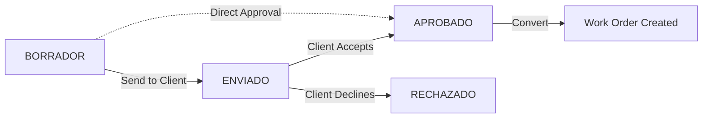

## Overview

The Quotations module handles your entire commercial pipeline, from initial cost estimates to approved production commitments. It bridges the gap between client requests and manufacturing execution with detailed line items, status tracking, and work order conversion.

<CardGroup cols={2}>
  <Card title="Multi-Item Quotations" icon="list">
    Add unlimited line items with quantities, units, costs, and time estimates
  </Card>
  <Card title="Status Workflow" icon="diagram-project">
    Track quotes through BORRADOR → ENVIADO → APROBADO/RECHAZADO lifecycle
  </Card>
  <Card title="Work Order Conversion" icon="arrows-turn-right">
    One-click conversion of approved quotes to production work orders
  </Card>
  <Card title="File Attachments" icon="paperclip">
    Attach specifications, drawings, or technical documents (PDF, images)
  </Card>
</CardGroup>

## Key Capabilities

### Quotation Management

- **Structured Pricing**: Break down costs with detailed line items
- **Time Estimation**: Track estimated hours and costs per item
- **Status Pipeline**: Formal approval workflow from draft to production
- **Validity Dates**: Set expiration dates with automatic warnings
- **Auto-numbering**: System generates sequential quotation codes (Q-2026-001)

### Document Control

- **File Attachments**: Upload technical specs, drawings, PDFs (max 10MB)
- **Version Control**: Track quote modifications with audit log
- **Client Visibility**: Manage which quotes are sent to clients

## Quotation Statuses

<Tabs>
  <Tab title="BORRADOR (Draft)">
    **Initial State**
    
    - Quotation is being prepared
    - Not visible to client
    - Can be freely edited or deleted
    - Use for internal cost calculations
    
    **Available Actions:**
    - Edit line items and pricing
    - Upload attachments
    - Change to ENVIADO when ready
  </Tab>
  
  <Tab title="ENVIADO (Sent)">
    **Client Review**
    
    - Quote has been sent to client
    - Awaiting client decision
    - Can still be edited if needed
    - Validity date is active
    
    **Available Actions:**
    - Update pricing if client negotiates
    - Upload revised documents
    - Mark as APROBADO or RECHAZADO
  </Tab>
  
  <Tab title="APROBADO (Approved)">
    **Ready for Production**
    
    - Client has accepted the quote
    - Can be converted to work order
    - Should not be deleted
    - Locked for major changes
    
    **Available Actions:**
    - Convert to work order
    - View linked work orders
    - Cannot delete if WO exists
  </Tab>
  
  <Tab title="RECHAZADO (Rejected)">
    **Declined by Client**
    
    - Client rejected the proposal
    - Kept for historical records
    - Can be deleted if no WO linked
    - Use for pipeline analysis
    
    **Available Actions:**
    - Review for future quotes
    - Delete if not needed
    - Analyze rejection patterns
  </Tab>
</Tabs>

## User Workflows

<Steps>
  <Step title="Create New Quotation">
    1. Click **+ Nueva Cotización** in the page header
    2. System generates next sequential code (e.g., Q-2026-045)
    3. Select client from dropdown
    4. Enter title and description
    5. Set estimated time (minutes) and total cost
    6. Optionally set validity date
    7. Status defaults to BORRADOR
  </Step>
  
  <Step title="Add Line Items">
    1. In the "Sub-items" section, fill in:
       - Item description (e.g., "Placa de acero inoxidable")
       - Quantity and unit
       - Unit cost
       - Estimated hours (optional)
    2. Click **+ Agregar Sub-Item**
    3. Item appears in list below
    4. Repeat for all materials/services
    5. Remove items with **Quitar** button if needed
  </Step>
  
  <Step title="Attach Technical Documents">
    1. Find quote in table, click **⚙️ Gestionar**
    2. Scroll to "📎 Archivo Adjunto" section
    3. Click file input and select PDF or image
    4. Click **Subir** to upload (max 10MB)
    5. File shows as "📍 Documento Cargado"
    6. Click **Ver Documento** to open in new tab
  </Step>
  
  <Step title="Update Quotation Status">
    1. Click **⚙️ Gestionar** on the quotation
    2. In "📊 Estado Comercial" section:
       - View current status badge
       - Select new status from dropdown
       - Click **Fijar Estado** to apply
    3. Status updates immediately with confirmation
  </Step>
  
  <Step title="Convert to Work Order">
    1. Update status to **APROBADO** first
    2. In management modal, find "🚀 Convertir a Orden de Trabajo"
    3. Review suggested OT code (e.g., OT-2026-045)
    4. Optionally set commitment date
    5. Click **⚡ Confirmar y Enviar a Producción**
    6. System creates work order with all details
    7. Original quote remains linked for reference
  </Step>
</Steps>

## UI Elements and Forms

### Quotation List Table

**Columns:**
- **Código**: Quotation identifier (sortable)
- **Cliente**: Client company name (sortable)
- **Título**: Quote description
- **Costo Est.**: Total estimated cost (sortable, formatted as currency)
- **Estado**: Status badge with color coding
- **Creado**: Creation date (sortable)
- **Acciones**: Gestionar button

**Features:**
- Click column headers to sort
- Search bar filters by code, title, or client name
- Status filter dropdown
- Results counter badge
- Expired quotes show "⚠️ VENCIDO" warning

### Create/Edit Form Structure

#### Identificadores (Identifiers)

| Field | Type | Required | Validation |
|-------|------|----------|------------|
| `code` | Text | Yes | Unique, format: Q-YYYY-NNN |
| `clientId` | Select | Yes | Must be active client |

#### Especificación (Specification)

| Field | Type | Required | Max Length |
|-------|------|----------|------------|
| `title` | Text | Yes | 200 chars |
| `description` | Textarea | Yes | 1000 chars |

#### Costeo General (Costing)

| Field | Type | Required | Validation |
|-------|------|----------|------------|
| `estimatedTimeMin` | Number | Yes | Min: 0 |
| `estimatedCost` | Decimal | Yes | Min: 0, step: 0.01 |
| `validUntil` | Date | No | Future date |
| `status` | Enum | Yes | BORRADOR, ENVIADO, APROBADO, RECHAZADO |

#### Sub-Items (Line Items)

Each item contains:

```typescript
interface QuotationItem {
  description: string;        // Required
  quantity: number;           // Required, min: 0.001
  unit: string;               // Required (e.g., "kg", "u", "m")
  estimatedUnitCost: number;  // Required, min: 0
  estimatedHoursMin?: number; // Optional
}
```

### Management Modal (Gestionar)

Access advanced features:

1. **🔧 Edición Técnica**: Opens full editor for line items
2. **📊 Estado Comercial**: Change quote status
3. **📎 Archivo Adjunto**: Upload/view/delete technical files
4. **🚀 Convertir a OT**: Convert approved quotes to production
5. **Delete Option**: Remove quotes (with restrictions)

## Approval Workflow



<Note>
  You can skip ENVIADO and go directly from BORRADOR to APROBADO for internal work orders or trusted clients.
</Note>

## Converting to Work Orders

### Prerequisites

<Accordion title="Required Conditions">
  - Quotation status must be **APROBADO**
  - Must have valid client assigned
  - OT code field must be filled
  - No validation errors in quote data
</Accordion>

### Conversion Process

1. **Data Inheritance**: New work order receives:
   - Client ID and name
   - Title and description
   - Estimated time and cost
   - All line items (as reference)
   - Link back to original quotation

2. **Work Order Defaults**:
   - Status: `PENDIENTE`
   - Priority: 3 (from company settings)
   - Code: User-specified (e.g., OT-2026-045)
   - Commitment date: Optional user input

3. **Post-Conversion**:
   - Quote remains in system
   - Quote cannot be deleted (has linked WO)
   - WO can be managed independently
   - Original quote preserved for audit

## File Attachment Management

### Supported Formats

- PDF documents
- Images: JPG, PNG, GIF
- Maximum size: **10 MB**

### Upload Process

```typescript
// Frontend implementation (QuotationsPage.tsx:212-224)
const formData = new FormData();
formData.append('file', file);
await api.post(`/quotations/${id}/attachment`, formData, {
  headers: { 'Content-Type': 'multipart/form-data' }
});
```

### Access Control

- Attachments stored in `/uploads/quotations/`
- Access via `/api/quotations/{id}/attachment`
- Files deleted when quotation is deleted
- One attachment per quotation (replace to update)

## Related Features

### Client Management

- Select from active client database
- Client name displayed in quote details
- Filter quotes by client

### Work Orders

- Approved quotes convert to work orders
- Bi-directional linking preserved
- Quote data drives production planning

### Reports & Analytics

- Quote pipeline analysis
- Approval rates by client
- Average quote value and time
- Conversion rate to work orders

## Role-Based Access

| Role | Create | Edit | Delete | View Status | Convert to WO | Upload Files |
|------|--------|------|--------|-------------|---------------|-------------|
| DUENO | ✅ | ✅ | ✅ | ✅ | ✅ | ✅ |
| ADMIN | ✅ | ✅ | ✅ | ✅ | ✅ | ✅ |
| SUPERVISOR | ✅ | ✅ | ⚠️ Limited | ✅ | ✅ | ✅ |
| OPERARIO | ❌ | ❌ | ❌ | 👁️ View only | ❌ | ❌ |

<Warning>
  Supervisors cannot delete quotations that have linked work orders. Only DUENO and ADMIN roles can override this restriction.
</Warning>

## Best Practices

<AccordionGroup>
  <Accordion title="Detailed Line Items">
    Break down costs into specific materials and services. This helps with:
    - Accurate production planning
    - Material procurement
    - Labor time allocation
    - Client transparency
  </Accordion>
  
  <Accordion title="Set Validity Dates">
    Always set `validUntil` dates for quotes:
    - Protects against price fluctuations
    - Creates urgency for client decisions
    - System shows "⚠️ VENCIDO" when expired
    - Typical range: 15-30 days from creation
  </Accordion>
  
  <Accordion title="Attach Technical Specs">
    Upload drawings, specifications, or reference images:
    - Reduces miscommunication
    - Provides production team with context
    - Client expectations documented
    - Serves as contract attachment
  </Accordion>
  
  <Accordion title="Status Discipline">
    Follow the status workflow strictly:
    - Keep BORRADOR quotes in draft folder
    - Mark ENVIADO only when actually sent
    - Update to APROBADO upon confirmation
    - Use RECHAZADO for analytics (don't just delete)
  </Accordion>
</AccordionGroup>

## Technical Implementation

**Source Code References:**

- Frontend: `apps/frontend/src/features/quotations/QuotationsPage.tsx`
- Backend DTO: `apps/backend/src/modules/quotations/dto/create-quotation.dto.ts`
- Status update: `apps/backend/src/modules/quotations/dto/update-quotation-status.dto.ts`
- Database: Prisma schema with `QuotationStatus` enum

**API Endpoints:**

```bash
GET    /api/quotations              # List all quotations
POST   /api/quotations              # Create new
PATCH  /api/quotations/{id}         # Update details
PATCH  /api/quotations/{id}/status  # Change status
POST   /api/quotations/{id}/attachment       # Upload file
DELETE /api/quotations/{id}/attachment       # Remove file
POST   /api/work-orders/from-quotation/{id}  # Convert to WO
DELETE /api/quotations/{id}         # Delete (with restrictions)
```
