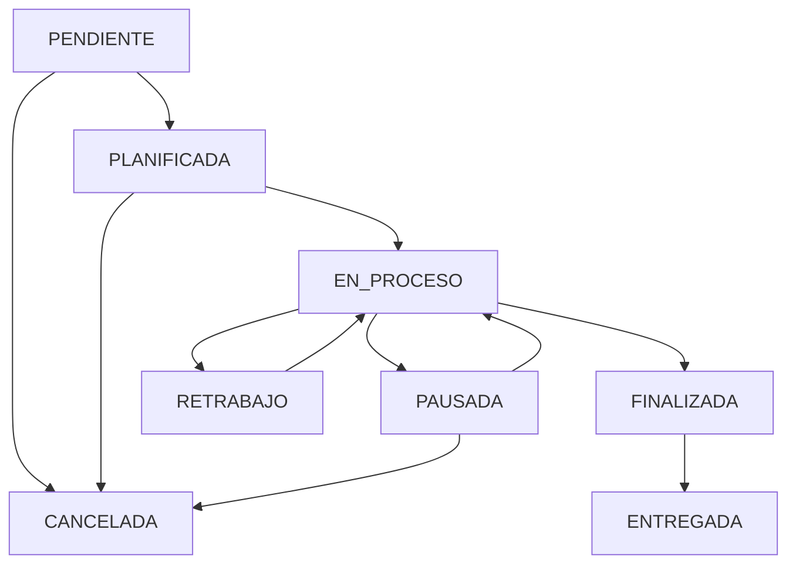

## Overview

Work Orders (Órdenes de Trabajo or OT) are the operational heart of DRAIT Mini-MES. They represent actual production jobs that move through your shop floor, tracking time, materials, events, and deliverables from planning to customer delivery.

<CardGroup cols={2}>
  <Card title="Complete Lifecycle" icon="rotate">
    Track orders through 8 status states from PENDIENTE to ENTREGADA
  </Card>
  <Card title="Resource Assignment" icon="user-gear">
    Assign human and machine resources with operator tracking
  </Card>
  <Card title="Event Logging" icon="clock-rotate-left">
    Full traceability with timestamped events (start, pause, finish)
  </Card>
  <Card title="Material Consumption" icon="box">
    Real-time stock deduction as operators consume materials
  </Card>
</CardGroup>

## Work Order Statuses

The system uses a formal status workflow to track production progress:

<Tabs>
  <Tab title="PENDIENTE">
    **Pending / New**
    
    - Initial status for new work orders
    - Awaiting resource assignment
    - Not yet scheduled for production
    - No time tracking active
    
    **Transitions to:**
    - PLANIFICADA (when scheduled)
    - CANCELADA (if customer cancels)
  </Tab>
  
  <Tab title="PLANIFICADA">
    **Scheduled**
    
    - Resources have been assigned
    - Planned for specific date/time
    - Materials reserved
    - Waiting for operator to start
    
    **Transitions to:**
    - EN_PROCESO (operator starts work)
    - CANCELADA (if cancelled)
  </Tab>
  
  <Tab title="EN_PROCESO">
    **In Process**
    
    - Active production in progress
    - Time tracking running
    - Operator working on job
    - Materials being consumed
    
    **Transitions to:**
    - PAUSADA (operator pauses)
    - FINALIZADA (operator completes)
    - RETRABAJO (quality issue detected)
  </Tab>
  
  <Tab title="PAUSADA">
    **Paused**
    
    - Temporarily stopped
    - Time tracking paused
    - Reason logged in event
    - Operator may be reassigned
    
    **Transitions to:**
    - EN_PROCESO (resume work)
    - CANCELADA (if abandoned)
  </Tab>
  
  <Tab title="FINALIZADA">
    **Finished**
    
    - Production work completed
    - Quality check passed
    - Ready for delivery prep
    - Total time calculated
    
    **Transitions to:**
    - ENTREGADA (customer delivery)
    - RETRABAJO (rework needed)
  </Tab>
  
  <Tab title="ENTREGADA">
    **Delivered**
    
    - Customer received goods
    - Delivery checklist completed
    - Optional signed receipt
    - Final status (immutable)
    
    **No further transitions**
  </Tab>
  
  <Tab title="CANCELADA">
    **Cancelled**
    
    - Order was abandoned
    - Reason documented
    - Materials returned to stock
    - Time tracking stopped
    
    **No further transitions**
  </Tab>
  
  <Tab title="RETRABAJO">
    **Rework**
    
    - Quality issues found
    - Requires correction
    - Additional time tracked
    - May consume extra materials
    
    **Transitions to:**
    - EN_PROCESO (resume work)
    - FINALIZADA (corrections complete)
  </Tab>
</Tabs>

## Key Capabilities

### Production Tracking

- **Priority System**: 1-5 scale (1=Highest, 5=Lowest)
- **Time Estimation**: Track estimated vs. actual hours
- **Cost Tracking**: Compare estimated cost to real material consumption
- **Commitment Dates**: Set customer delivery deadlines with alerts
- **Event History**: Complete audit trail of all status changes

### Resource Management

- **Assignment**: Link work orders to human operators and machines
- **Capacity Planning**: View operator workload across orders
- **Real-time Updates**: Live status visible in Supervisor dashboard

### Material Integration

- **Consumption Logging**: Operators record material usage
- **Stock Deduction**: Automatic inventory adjustment
- **Cost Capture**: Snapshot unit costs at time of consumption
- **Traceability**: Link materials to specific work orders

## User Workflows

<Steps>
  <Step title="Create Work Order">
    **Manual Creation:**
    1. Click **+ Nueva Orden** in page header
    2. Enter unique code (e.g., OT-2026-045)
    3. Select client from dropdown
    4. Fill title and description
    5. Set priority (1-5)
    6. Enter estimated time (minutes) and cost
    7. Optionally set commitment date
    8. Click **Crear OT**
    
    **From Approved Quotation:**
    1. Open quotation in Quotations module
    2. Set status to APROBADO
    3. Click "Convertir a Orden de Trabajo"
    4. Enter OT code and optional commitment date
    5. Click **Confirmar y Enviar a Producción**
  </Step>
  
  <Step title="Assign Resources">
    1. Find work order in table
    2. Click **⚙️ Gest.** (Gestionar) button
    3. In "Asignar Puesto" section:
       - Select operator from dropdown
       - System matches with HUMANO resource type
       - Click **Asignar**
    4. Assignment appears in OT detail view
    5. Operator sees OT in their terminal
  </Step>
  
  <Step title="Start Production (Operator)">
    1. Operator logs into their terminal
    2. Sees assigned work orders in "Cola de Trabajo"
    3. Clicks **▶ Iniciar** button
    4. System creates INICIO event with timestamp
    5. Status changes to EN_PROCESO
    6. Time tracking begins automatically
  </Step>
  
  <Step title="Record Material Consumption">
    1. Operator selects work order
    2. Clicks **📦 Insumos y Notas**
    3. In "Registrar Consumo" section:
       - Select material from dropdown (shows current stock)
       - Enter quantity consumed
       - Add optional note
       - Click **+ Registrar Consumo Fisico**
    4. System:
       - Deducts from material stock
       - Creates consumption record
       - Captures unit cost snapshot
       - Updates work order cost tracking
  </Step>
  
  <Step title="Complete and Deliver">
    1. Operator clicks **⏹ Finalizar** when done
    2. Status changes to FINALIZADA
    3. Supervisor opens management modal
    4. In "Completar (Remito)" section:
       - Fill delivery checklist
       - Set delivery date/time
       - Check "Remito Firmado" if signed
       - Upload delivery receipt (optional)
       - Click **Emitir**
    5. Status changes to ENTREGADA
    6. Work order locked from further changes
  </Step>
</Steps>

## Event Logging System

All work order state changes are recorded as events with automatic timestamps:

### Event Types

| Event Type | Triggered By | Description |
|------------|--------------|-------------|
| `INICIO` | Operator | Work started, time tracking begins |
| `PAUSA` | Operator | Work paused temporarily |
| `REANUDACION` | Operator | Work resumed after pause |
| `FINALIZACION` | Operator | Production completed |
| `NOTA` | Operator | Free-text comment/observation |
| `ASIGNACION` | Supervisor | Resource assigned to order |
| `CAMBIO_ESTADO` | System | Status changed programmatically |

### Event Data Structure

```typescript
interface OperationLog {
  id: string;
  eventType: string;
  eventAt: string;      // ISO timestamp
  note?: string;        // Optional description
  user?: {              // Who performed action
    id: string;
    fullName: string;
  };
}
```

### Viewing Event History

Events appear in:
- Work order detail sidebar
- Operator terminal bitácora
- Supervisor dashboard timeline
- Audit reports

## Material Consumption Tracking

### Consumption Process

1. **Operator Action**: Records material usage in real-time
2. **Stock Deduction**: System reduces material inventory
3. **Cost Snapshot**: Current `unitCost` captured at consumption time
4. **Traceability**: Links consumption to specific WO and timestamp

### Consumption Record

```typescript
interface MaterialConsumption {
  id: string;
  workOrderId: string;
  materialId: string;
  quantity: number;
  unitCostSnapshot: number;  // Price at time of use
  note?: string;
  consumedAt: string;        // ISO timestamp
  material: {
    name: string;
    unit: string;
  };
}
```

### Cost Tracking Impact

- **Real Cost Calculation**: Sum of all consumption `quantity * unitCostSnapshot`
- **Deviation Analysis**: Compare to original estimated cost
- **Alert Triggers**: Warnings when actual exceeds estimate by threshold
- **Reports**: Material consumption by WO, client, or time period

## Status Transitions



<Note>
  The status workflow is enforced by the backend. You cannot skip required intermediate states or move backwards except through RETRABAJO.
</Note>

## UI Elements and Forms

### Work Order List Table

**Main Columns:**
- **Código**: OT identifier with visual emphasis
- **Cliente / Proy.**: Client name and project title
- **Estado**: Status badge with color coding
- **Prior.**: Priority as 1-5 dot indicators
- **Creada**: Creation timestamp
- **Acciones**: Ver Ficha and Gestionar buttons

**Interactive Features:**
- Click row to highlight and show detail sidebar
- Sort by any column (click header)
- Filter by status dropdown
- Search by code, title, or client
- Real-time count badge

### Create Work Order Form

| Field | Type | Required | Validation |
|-------|------|----------|------------|
| `code` | Text | Yes | Unique identifier |
| `clientId` | Select | Yes | Active client UUID |
| `title` | Text | Yes | Max 200 chars |
| `description` | Textarea | Yes | Max 1000 chars |
| `priority` | Number | Yes | 1-5 (default: 3) |
| `estimatedTimeMin` | Number | Yes | Minutes, min: 0 |
| `estimatedCost` | Decimal | Yes | Min: 0, step: 0.01 |
| `commitmentDate` | DateTime | No | Future date |
| `notes` | Textarea | No | Internal notes |

### Management Modal Actions

1. **Modificar Datos Base**: Update code, title, client, dates
2. **Asignar Puesto**: Link operator to work order
3. **Completar (Remito)**: Delivery checklist and receipt upload
4. **Eliminar Producción**: Delete order (restricted)

### Detail Sidebar (Ficha Técnica)

Shows when order is selected:
- Code and status badge
- Title and description
- Client name
- Commitment date
- Active assignments (resource + operator)
- Quick access buttons

## Role-Based Workflows

<Tabs>
  <Tab title="Operator Terminal">
    **Capabilities:**
    - View assigned work orders only
    - Start, pause, resume, finish production
    - Record material consumption
    - Add notes to bitácora
    - View event history
    
    **Restrictions:**
    - Cannot see unassigned orders
    - Cannot modify assignments
    - Cannot delete or cancel orders
    - Cannot complete delivery
  </Tab>
  
  <Tab title="Supervisor Dashboard">
    **Real-Time Monitoring:**
    - All work orders across statuses
    - Active production tracking
    - Delayed order alerts
    - Operator workload distribution
    - Auto-refresh every 30 seconds
    
    **Actions:**
    - Assign operators to orders
    - View production timeline
    - Monitor commitment dates
    - Generate productivity reports
  </Tab>
  
  <Tab title="Admin Management">
    **Full Control:**
    - Create work orders manually
    - Edit all fields and assignments
    - Change status manually if needed
    - Complete delivery process
    - Upload/delete attachments
    - Delete orders (with restrictions)
    - Access all reports and analytics
  </Tab>
</Tabs>

## Related Features

### Quotations

- Approved quotations convert to work orders
- Original quote data preserved
- Link maintained for reference
- Cannot delete quote with linked WO

### Resources & Capacity

- Assign HUMANO resources to orders
- View operator workload
- Track machine utilization
- Capacity planning based on assignments

### Materials & Inventory

- Real-time stock consumption
- Cost tracking with snapshots
- Movement audit trail
- Low stock alerts

### Reports & Analytics

- Time deviation analysis
- Cost deviation alerts
- Productivity by operator
- Client delivery performance
- Financial margin tracking

## Best Practices

<AccordionGroup>
  <Accordion title="Accurate Time Estimates">
    Use historical data to improve estimates:
    - Review actual vs. estimated hours in reports
    - Adjust future estimates based on patterns
    - Factor in setup and cleanup time
    - Account for machine vs. operator time
  </Accordion>
  
  <Accordion title="Material Recording Discipline">
    Train operators to record consumption immediately:
    - Record as materials are used, not at end of shift
    - Use notes field for batch numbers or quality observations
    - Verify stock levels before starting production
    - Report discrepancies to supervisor
  </Accordion>
  
  <Accordion title="Priority Management">
    Use the 5-level priority system effectively:
    - **1 (Highest)**: Rush orders, expedited delivery
    - **2-3 (Normal)**: Standard production queue
    - **4-5 (Lower)**: Filler work, non-urgent
    - Review priorities weekly based on commitment dates
  </Accordion>
  
  <Accordion title="Delivery Documentation">
    Always complete delivery checklists:
    - Upload signed delivery receipt when possible
    - Document delivery time for tracking
    - Note any delivery issues or partial deliveries
    - Include transport company if applicable
  </Accordion>
</AccordionGroup>

## Technical Implementation

**Source Code:**

- Frontend WO management: `apps/frontend/src/features/work-orders/WorkOrdersPage.tsx`
- Operator terminal: `apps/frontend/src/features/operator/OperatorPage.tsx`
- Supervisor dashboard: `apps/frontend/src/features/supervisor/SupervisorPage.tsx`
- Backend DTO: `apps/backend/src/modules/work-orders/dto/create-work-order.dto.ts`
- Event logging: `apps/backend/src/modules/work-orders/dto/add-event.dto.ts`
- Consumption: `apps/backend/src/modules/work-orders/dto/add-consumption.dto.ts`

**API Endpoints:**

```bash
GET    /api/work-orders                          # List all
GET    /api/work-orders?assignedToMe=true        # Operator view
GET    /api/work-orders/{id}                     # Details
POST   /api/work-orders                          # Create
POST   /api/work-orders/from-quotation/{id}     # From quote
PATCH  /api/work-orders/{id}                     # Update
PATCH  /api/work-orders/{id}/status              # Change status
POST   /api/work-orders/{id}/assignments         # Assign resource
POST   /api/work-orders/{id}/events              # Log event
POST   /api/work-orders/{id}/consumptions        # Record material
POST   /api/work-orders/{id}/close-delivery      # Complete
POST   /api/work-orders/{id}/attachment          # Upload file
DELETE /api/work-orders/{id}/attachment          # Remove file
DELETE /api/work-orders/{id}                     # Delete (restricted)
```

<Warning>
  Work orders cannot be deleted if they have any assignments, consumptions, or events. This preserves production history and audit trails.
</Warning>
